# Data Science weather analysis
## Objective

Analyzed changes in weather with respect to distance from the equator.

Pulled data from OpenWeatherMap API to assemble a dataser on over 500 cities.

Summary statistics and visualizations created using Python, Pandas, Matplotlib and gmaps.

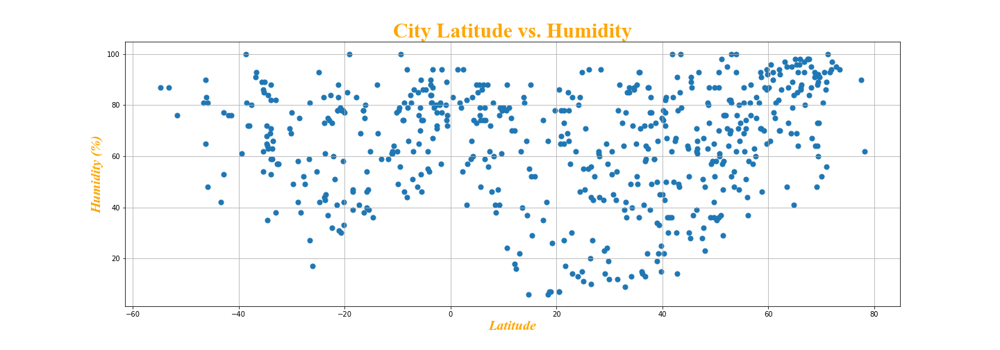
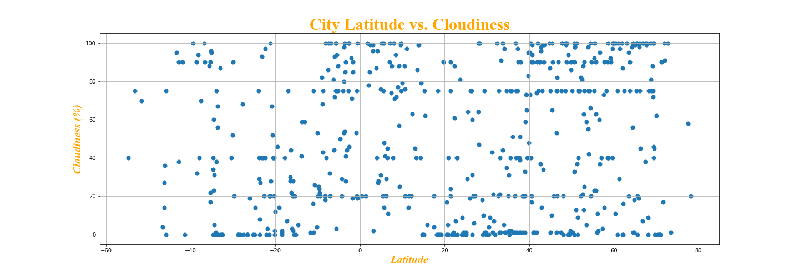
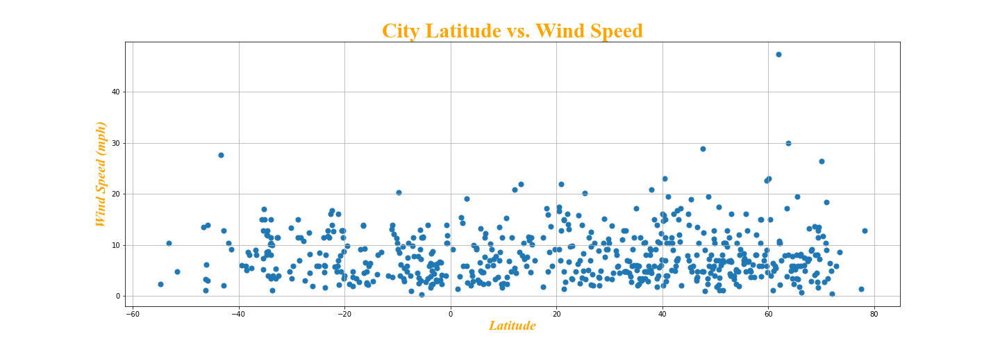
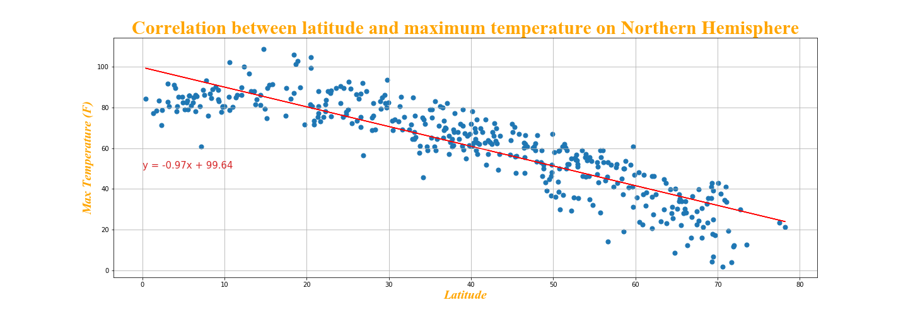
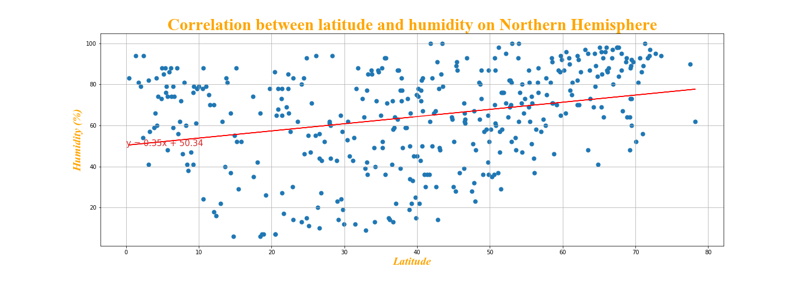
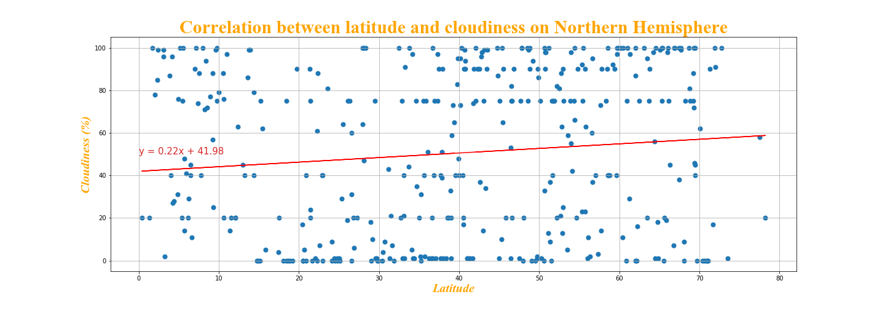
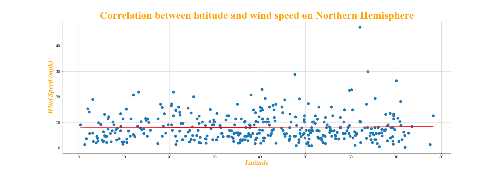
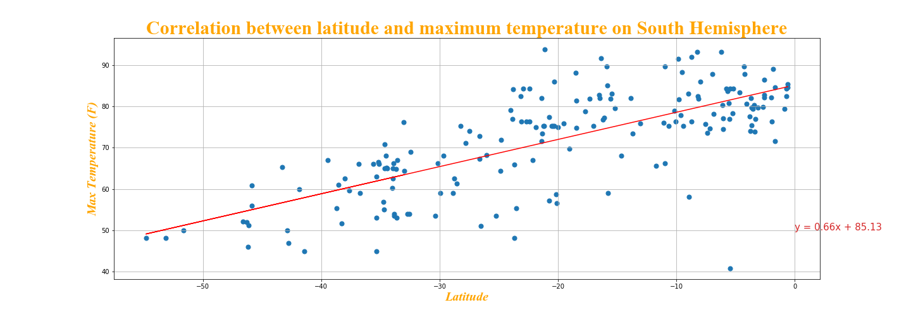
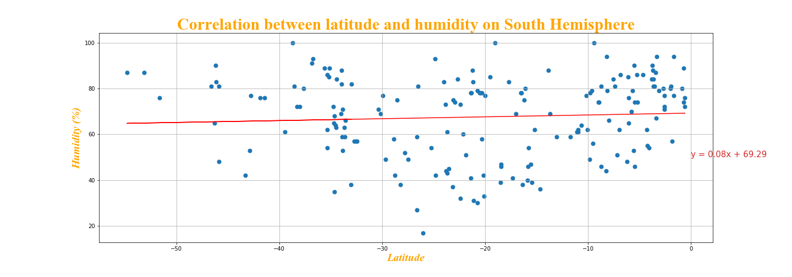
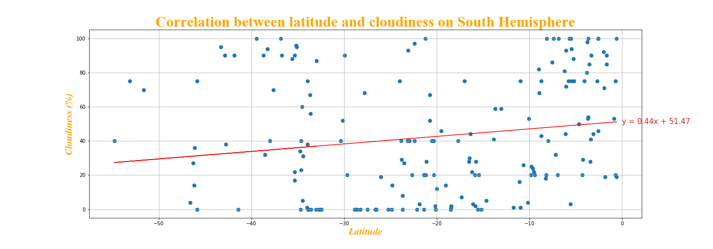
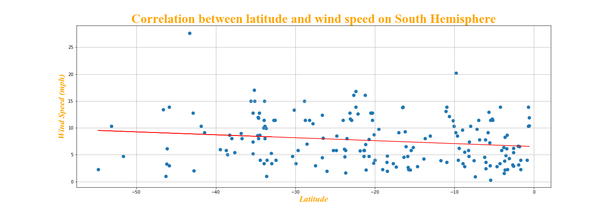
